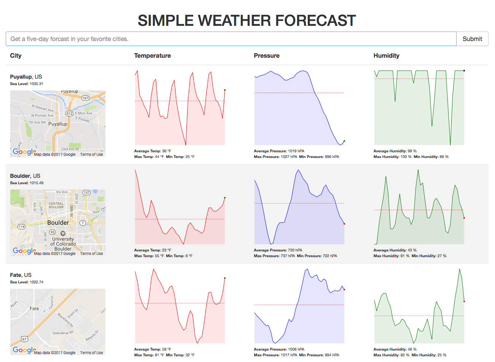

# Simple Weather Forecast


Checkout this repo, install dependencies, then start the dev server with:

  - `git clone git@github.com:mfi-dev/react-redux-boilerplate.git`

  - `cd react-redux-boilerplate`

  - `npm i`

  - `npm i -g eslint babel-eslint
   eslint-config-es2015 eslint-config-standard eslint-config-standard-react eslint-plugin-react eslint`

  - `npm start`


__You will have to provide two json files int he app/auth directory, both in the form of__:
  ```
  {
    "key": "YOUR_API_KEY_GOES_HERE"
  }
  ```
  [OpenWeatherMap API](http://openweathermap.org)
  - app/auth/openweathermap.json
  [Google Maps API](https://developers.google.com/maps/) (Step 1, "Get a key")
  - app/auth/googlemapsapi.json
